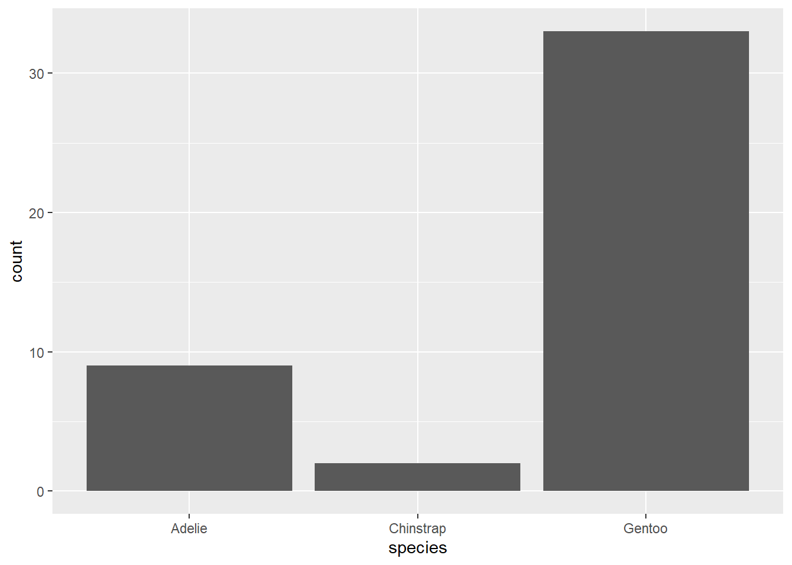
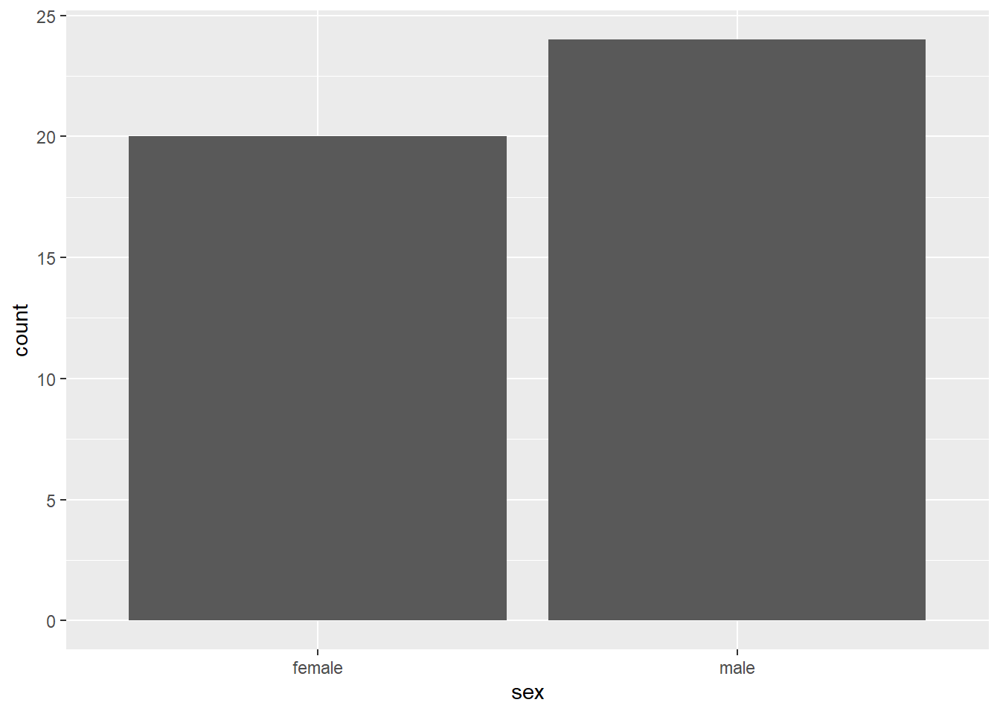
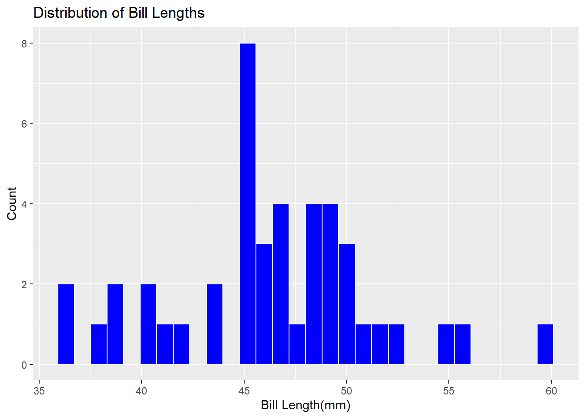
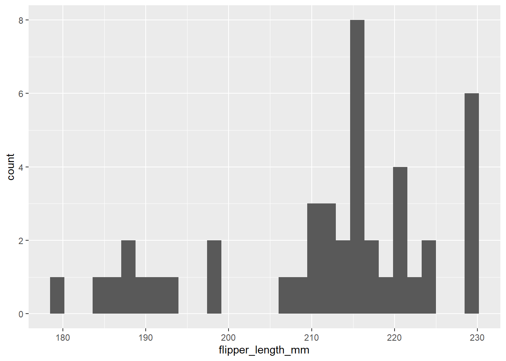
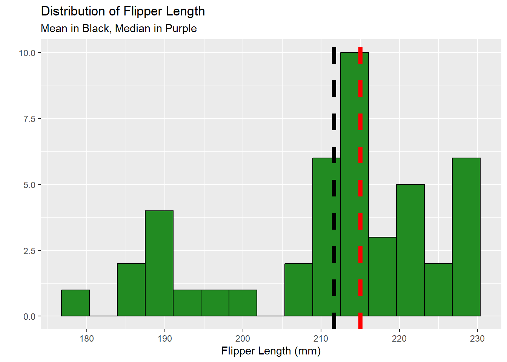
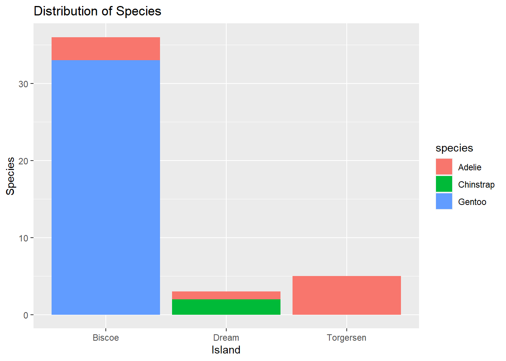
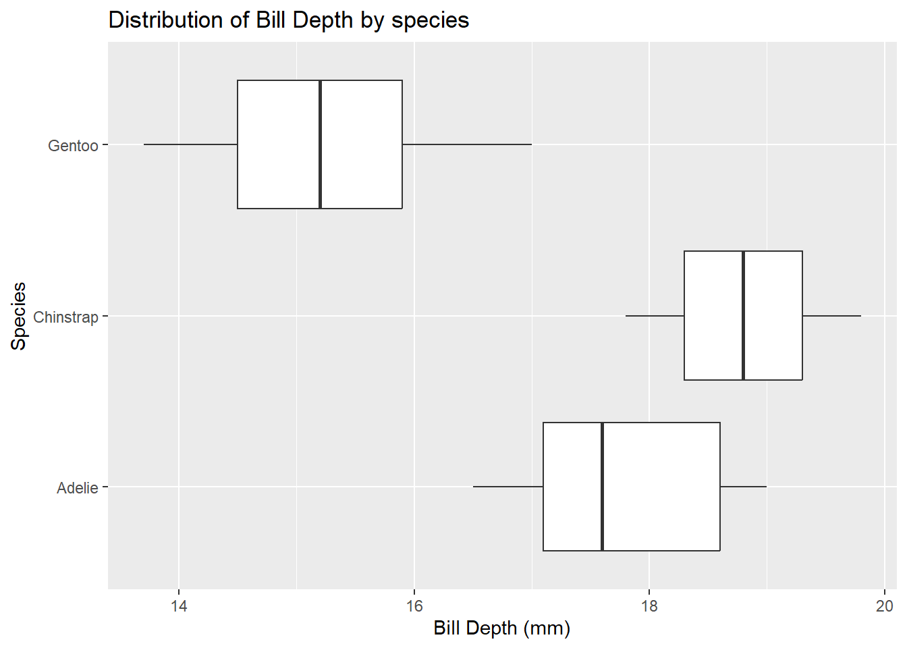
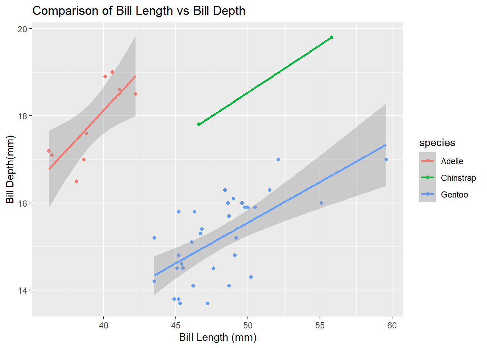

## *Palmer Penguins*

This document analysizes different populations of penguins and their relative weights and sizes. This is my first notebook.

## Running Code

Here we will load the tidyverse package and paenguins dataset


::: {.cell}

```{.r .cell-code}
#Load the tidyverse
library(tidyverse)
```

::: {.cell-output .cell-output-stderr}
```
── Attaching packages ─────────────────────────────────────── tidyverse 1.3.2 ──
✔ ggplot2 3.4.0      ✔ purrr   1.0.0 
✔ tibble  3.1.8      ✔ dplyr   1.0.10
✔ tidyr   1.2.1      ✔ stringr 1.5.0 
✔ readr   2.1.3      ✔ forcats 0.5.2 
── Conflicts ────────────────────────────────────────── tidyverse_conflicts() ──
✖ dplyr::filter() masks stats::filter()
✖ dplyr::lag()    masks stats::lag()
```
:::

```{.r .cell-code}
library(kableExtra)
```

::: {.cell-output .cell-output-stderr}
```

Attaching package: 'kableExtra'

The following object is masked from 'package:dplyr':

    group_rows
```
:::

```{.r .cell-code}
#Read the penguins_samp1 data file from github
penguins <- read_csv("https://raw.githubusercontent.com/mcduryea/Intro-to-Bioinformatics/main/data/penguins_samp1.csv")
```

::: {.cell-output .cell-output-stderr}
```
Rows: 44 Columns: 8
── Column specification ────────────────────────────────────────────────────────
Delimiter: ","
chr (3): species, island, sex
dbl (5): bill_length_mm, bill_depth_mm, flipper_length_mm, body_mass_g, year

ℹ Use `spec()` to retrieve the full column specification for this data.
ℹ Specify the column types or set `show_col_types = FALSE` to quiet this message.
```
:::

```{.r .cell-code}
#See the first six rows of the data we've read in to our notebook. Clean up tables with kable extra.
penguins %>%
  head() %>%
  kable() %>%
  kable_styling(c("striped","hover"))
```

::: {.cell-output-display}

`````{=html}
<table class="table table-striped table-hover" style="margin-left: auto; margin-right: auto;">
 <thead>
  <tr>
   <th style="text-align:left;"> species </th>
   <th style="text-align:left;"> island </th>
   <th style="text-align:right;"> bill_length_mm </th>
   <th style="text-align:right;"> bill_depth_mm </th>
   <th style="text-align:right;"> flipper_length_mm </th>
   <th style="text-align:right;"> body_mass_g </th>
   <th style="text-align:left;"> sex </th>
   <th style="text-align:right;"> year </th>
  </tr>
 </thead>
<tbody>
  <tr>
   <td style="text-align:left;"> Gentoo </td>
   <td style="text-align:left;"> Biscoe </td>
   <td style="text-align:right;"> 59.6 </td>
   <td style="text-align:right;"> 17.0 </td>
   <td style="text-align:right;"> 230 </td>
   <td style="text-align:right;"> 6050 </td>
   <td style="text-align:left;"> male </td>
   <td style="text-align:right;"> 2007 </td>
  </tr>
  <tr>
   <td style="text-align:left;"> Gentoo </td>
   <td style="text-align:left;"> Biscoe </td>
   <td style="text-align:right;"> 48.6 </td>
   <td style="text-align:right;"> 16.0 </td>
   <td style="text-align:right;"> 230 </td>
   <td style="text-align:right;"> 5800 </td>
   <td style="text-align:left;"> male </td>
   <td style="text-align:right;"> 2008 </td>
  </tr>
  <tr>
   <td style="text-align:left;"> Gentoo </td>
   <td style="text-align:left;"> Biscoe </td>
   <td style="text-align:right;"> 52.1 </td>
   <td style="text-align:right;"> 17.0 </td>
   <td style="text-align:right;"> 230 </td>
   <td style="text-align:right;"> 5550 </td>
   <td style="text-align:left;"> male </td>
   <td style="text-align:right;"> 2009 </td>
  </tr>
  <tr>
   <td style="text-align:left;"> Gentoo </td>
   <td style="text-align:left;"> Biscoe </td>
   <td style="text-align:right;"> 51.5 </td>
   <td style="text-align:right;"> 16.3 </td>
   <td style="text-align:right;"> 230 </td>
   <td style="text-align:right;"> 5500 </td>
   <td style="text-align:left;"> male </td>
   <td style="text-align:right;"> 2009 </td>
  </tr>
  <tr>
   <td style="text-align:left;"> Gentoo </td>
   <td style="text-align:left;"> Biscoe </td>
   <td style="text-align:right;"> 55.1 </td>
   <td style="text-align:right;"> 16.0 </td>
   <td style="text-align:right;"> 230 </td>
   <td style="text-align:right;"> 5850 </td>
   <td style="text-align:left;"> male </td>
   <td style="text-align:right;"> 2009 </td>
  </tr>
  <tr>
   <td style="text-align:left;"> Gentoo </td>
   <td style="text-align:left;"> Biscoe </td>
   <td style="text-align:right;"> 49.8 </td>
   <td style="text-align:right;"> 15.9 </td>
   <td style="text-align:right;"> 229 </td>
   <td style="text-align:right;"> 5950 </td>
   <td style="text-align:left;"> male </td>
   <td style="text-align:right;"> 2009 </td>
  </tr>
</tbody>
</table>

`````

:::
:::


The different tables are organized by species, the island the species was found, its bill length and depth, flipper length and depth, the body mass, year of discovery, and sex.

## About our data

The data we are working with is a dataset on Penguins, which features the variables: species, island, bill length/depth, flipper length, body mass, sex, and year.

-   What is the average flipper length by species?

-   Are there more male or female penguins on each island?

-   What is the mean body mass per island, species, sex?

-   What is the ratio of bill length to bill depth for a penguin? What is the overall average of this metric? Does it change by species, sex, or island?

-   Does average body mass change by year?

## Data Manipulation Tools and Strategies

We can look at individual columns in in a data set or subsets of columns in a dataset. If we are only interested in flipper length and species, we can `select()` those columns

/


::: {.cell}

```{.r .cell-code}
penguins %>%
  select(species, body_mass_g)
```

::: {.cell-output .cell-output-stdout}
```
# A tibble: 44 × 2
   species body_mass_g
   <chr>         <dbl>
 1 Gentoo         6050
 2 Gentoo         5800
 3 Gentoo         5550
 4 Gentoo         5500
 5 Gentoo         5850
 6 Gentoo         5950
 7 Gentoo         5700
 8 Gentoo         5350
 9 Gentoo         5550
10 Gentoo         6300
# … with 34 more rows
```
:::
:::


if we want to `filter()` and only show certain rows, we can do that too.


::: {.cell}

```{.r .cell-code}
penguins%>%
  filter(species == "Chinstrap")
```

::: {.cell-output .cell-output-stdout}
```
# A tibble: 2 × 8
  species   island bill_length_mm bill_depth_mm flipper_le…¹ body_…² sex    year
  <chr>     <chr>           <dbl>         <dbl>        <dbl>   <dbl> <chr> <dbl>
1 Chinstrap Dream            55.8          19.8          207    4000 male   2009
2 Chinstrap Dream            46.6          17.8          193    3800 fema…  2007
# … with abbreviated variable names ¹​flipper_length_mm, ²​body_mass_g
```
:::

```{.r .cell-code}
#we can see also do both
penguins%>%
  filter((body_mass_g == 6000) | (island == "Togersen"))
```

::: {.cell-output .cell-output-stdout}
```
# A tibble: 0 × 8
# … with 8 variables: species <chr>, island <chr>, bill_length_mm <dbl>,
#   bill_depth_mm <dbl>, flipper_length_mm <dbl>, body_mass_g <dbl>, sex <chr>,
#   year <dbl>
```
:::
:::


## Answering Our Questions

Most of our questions involve summarizing data, and perhaps summarizing our groups. We can summarize data using the `summarize()` function and group data using `group_by()`.

Let's find the average flipper length.


::: {.cell}

```{.r .cell-code}
penguins%>%
  summarize(avg_flipper_length = mean(flipper_length_mm))
```

::: {.cell-output .cell-output-stdout}
```
# A tibble: 1 × 1
  avg_flipper_length
               <dbl>
1               212.
```
:::

```{.r .cell-code}
penguins%>%
  filter(species == "Gentoo") %>%
  summarize(avg_flipper_length = mean(flipper_length_mm))
```

::: {.cell-output .cell-output-stdout}
```
# A tibble: 1 × 1
  avg_flipper_length
               <dbl>
1               218.
```
:::

```{.r .cell-code}
#Grouped Average
penguins%>%
  group_by(species) %>%
  summarize(avg_flipper_length = mean(flipper_length_mm))
```

::: {.cell-output .cell-output-stdout}
```
# A tibble: 3 × 2
  species   avg_flipper_length
  <chr>                  <dbl>
1 Adelie                  189.
2 Chinstrap               200 
3 Gentoo                  218.
```
:::
:::

::: {.cell}

```{.r .cell-code}
#Are there more male or female penguins
penguins%>%
  count(sex)
```

::: {.cell-output .cell-output-stdout}
```
# A tibble: 2 × 2
  sex        n
  <chr>  <int>
1 female    20
2 male      24
```
:::

```{.r .cell-code}
#What is the mean body mass per island
penguins%>%
  group_by(island)%>%
  summarize(avg_body_mass_g = mean(body_mass_g))
```

::: {.cell-output .cell-output-stdout}
```
# A tibble: 3 × 2
  island    avg_body_mass_g
  <chr>               <dbl>
1 Biscoe              5099.
2 Dream               3783.
3 Torgersen           3330 
```
:::

```{.r .cell-code}
#What is the mean body mass per species
penguins%>%
  group_by(species)%>%
  summarize(avg_body_mass_g = mean(body_mass_g))
```

::: {.cell-output .cell-output-stdout}
```
# A tibble: 3 × 2
  species   avg_body_mass_g
  <chr>               <dbl>
1 Adelie              3464.
2 Chinstrap           3900 
3 Gentoo              5230.
```
:::

```{.r .cell-code}
#What is the mean body mass per sex
penguins%>%
  group_by(sex)%>%
  summarize(avg_body_mass_g = mean(body_mass_g))
```

::: {.cell-output .cell-output-stdout}
```
# A tibble: 2 × 2
  sex    avg_body_mass_g
  <chr>            <dbl>
1 female           4258.
2 male             5268.
```
:::
:::


We can `mutate()` to add new columns to our data set


::: {.cell}

```{.r .cell-code}
#What is the bill length to depth ratio
penguins%>%
  group_by(species)%>%
  mutate(bill_ltd_ratio = bill_length_mm / bill_depth_mm)%>%
  summarize(avg_bill_ltd_ratio = mean(bill_ltd_ratio),
            median_bill_ltd_ratio  = median(bill_ltd_ratio))
```

::: {.cell-output .cell-output-stdout}
```
# A tibble: 3 × 3
  species   avg_bill_ltd_ratio median_bill_ltd_ratio
  <chr>                  <dbl>                 <dbl>
1 Adelie                  2.20                  2.20
2 Chinstrap               2.72                  2.72
3 Gentoo                  3.17                  3.13
```
:::

```{.r .cell-code}
#What is the 
penguins%>%
  group_by(year)%>%
  summarize(mean_body_mass = mean(body_mass_g))
```

::: {.cell-output .cell-output-stdout}
```
# A tibble: 3 × 2
   year mean_body_mass
  <dbl>          <dbl>
1  2007          5079.
2  2008          4929.
3  2009          4518.
```
:::
:::


## Data Visualization with `ggplot()`

There are entire courses on data visualization. We'll give you just a taste of it here.

**One Categorical Variable:** We can visualize a categorical variable with a barplot


::: {.cell}

```{.r .cell-code}
penguins%>%
  ggplot() +
  geom_bar(mapping = aes(x = species))
```

::: {.cell-output-display}
{width=672}
:::

```{.r .cell-code}
  labs(title = "counts of Penguin Species", x = "Species", y = "Count")
```

::: {.cell-output .cell-output-stdout}
```
$x
[1] "Species"

$y
[1] "Count"

$title
[1] "counts of Penguin Species"

attr(,"class")
[1] "labels"
```
:::
:::


-   This plot shows that the gentoo species are by far the most numerous and the chinstrap are numbered the lowest.

-   The + sign in the ggplot is meant to add the specific data visualization method (barplot, histogram, etc.)


::: {.cell}

```{.r .cell-code}
penguins%>%
  ggplot() +
  geom_bar(mapping = aes(x = sex)) 
```

::: {.cell-output-display}
{width=672}
:::

```{.r .cell-code}
  labs(title = "Counts of Penguins by Sex", x = "Island", y= "Count")
```

::: {.cell-output .cell-output-stdout}
```
$x
[1] "Island"

$y
[1] "Count"

$title
[1] "Counts of Penguins by Sex"

attr(,"class")
[1] "labels"
```
:::
:::


Histograms will show the shape of the data

Boxplots are great at finding outliers and where your data "lives".

One categorical variable: Barplot

Comparing two numerical variables: scatterplot

Two categorical variables: barplots with fill color

One numerical one categorical: side by side boxplots. Overlayed histograms. "faceting"

**One Numerical Variable**: Distribution of Bill Lengths (Histograms or Boxplots)


::: {.cell}

```{.r .cell-code}
penguins%>%
  ggplot()+
  geom_histogram(mapping = aes(x=bill_length_mm),
                 color = "white",
                 fill = "blue") +
  labs(title = "Distribution of Bill Lengths",
       x= "Bill Length(mm)", y="Count")
```

::: {.cell-output .cell-output-stderr}
```
`stat_bin()` using `bins = 30`. Pick better value with `binwidth`.
```
:::

::: {.cell-output-display}
{width=672}
:::
:::


**Distribution of Flipper Length**


::: {.cell}

```{.r .cell-code}
penguins%>%
  ggplot() +
  geom_histogram(mapping = aes(x=flipper_length_mm))
```

::: {.cell-output .cell-output-stderr}
```
`stat_bin()` using `bins = 30`. Pick better value with `binwidth`.
```
:::

::: {.cell-output-display}
{width=672}
:::

```{.r .cell-code}
  labs(title = "Distribution of Penguin Flipper Length", x = "Flipper Length", y = "Count")
```

::: {.cell-output .cell-output-stdout}
```
$x
[1] "Flipper Length"

$y
[1] "Count"

$title
[1] "Distribution of Penguin Flipper Length"

attr(,"class")
[1] "labels"
```
:::
:::

::: {.cell}

```{.r .cell-code}
penguins%>%
  ggplot()+
  geom_histogram(aes(x=flipper_length_mm),
                bins = 15,
                fill = "forestgreen",
                color = "black") +
  labs(title="Distribution of Flipper Length", 
       y="", x = "Flipper Length (mm)",
       subtitle ="Mean in Black, Median in Purple") +
  geom_vline(aes(xintercept = mean(flipper_length_mm)), lwd = 2, lty = "dashed") +
  geom_vline(aes(xintercept = median(flipper_length_mm)), fill ="black",
             color="red", lwd = 2, lty = "dashed")
```

::: {.cell-output .cell-output-stderr}
```
Warning: Using `size` aesthetic for lines was deprecated in ggplot2 3.4.0.
ℹ Please use `linewidth` instead.
```
:::

::: {.cell-output .cell-output-stderr}
```
Warning in geom_vline(aes(xintercept = median(flipper_length_mm)), fill =
"black", : Ignoring unknown parameters: `fill`
```
:::

::: {.cell-output-display}
{width=672}
:::
:::


-   The data is skewed left since the mean is lower than the median

**Distribution of Species**


::: {.cell}

```{.r .cell-code}
penguins%>%
  ggplot()+
  geom_bar(mapping = aes(x=island, fill = species)) +
  labs(title = "Distribution of Species",
       x= "Island",
       y= "Species")
```

::: {.cell-output-display}
{width=672}
:::
:::


**One Numerical and One Categorical**: Bill Depth by Species


::: {.cell}

```{.r .cell-code}
penguins%>%
  ggplot() +
  geom_boxplot(mapping = aes(x=bill_depth_mm, y = species)) +
  labs(title = "Distribution of Bill Depth by species", x = "Bill Depth (mm)", y = "Species")
```

::: {.cell-output-display}
{width=672}
:::
:::


**Two Numerical Variable**: Bill Length vs Bill Depth (scatterplot)


::: {.cell}

```{.r .cell-code}
penguins%>%
  ggplot() +
  geom_point(aes(x = bill_length_mm, y = bill_depth_mm, color = species))+
  geom_smooth(aes(x = bill_length_mm, y = bill_depth_mm, color = species), method = "lm")+
  labs(title = "Comparison of Bill Length vs Bill Depth", x = "Bill Length (mm)", y= "Bill Depth(mm)")
```

::: {.cell-output .cell-output-stderr}
```
`geom_smooth()` using formula = 'y ~ x'
```
:::

::: {.cell-output .cell-output-stderr}
```
Warning in qt((1 - level)/2, df): NaNs produced
```
:::

::: {.cell-output .cell-output-stderr}
```
Warning in max(ids, na.rm = TRUE): no non-missing arguments to max; returning
-Inf
```
:::

::: {.cell-output-display}
{width=672}
:::
:::


Within each species, the longer the beak, the deeper the beak.
